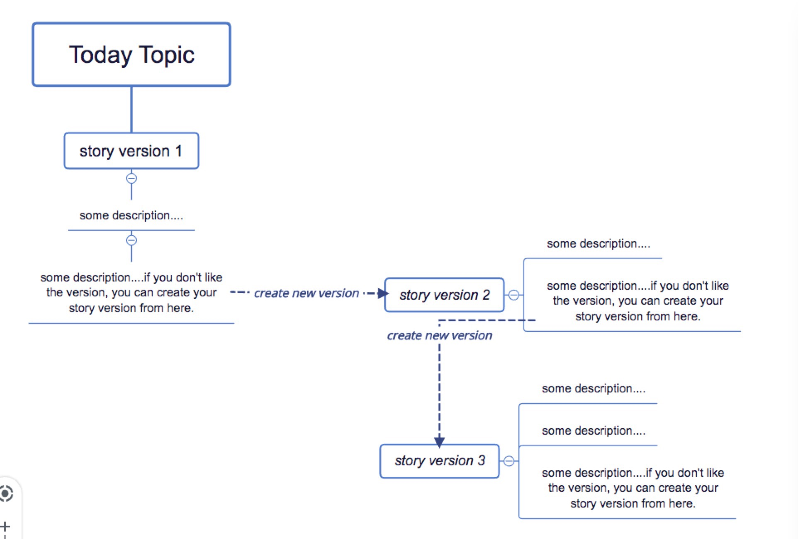

# onetopicaday
redux react demo -- use yoman react-webpack to genenrate project

> npm install

> npm run start

The demo do something like below.

Everyday, manager will create a new topic, everyone can publish the idea about the topic to make a story. If your don't like someone's idea, you can create a new version about it. A topic can have 5 versions story. Just enjoy it.

